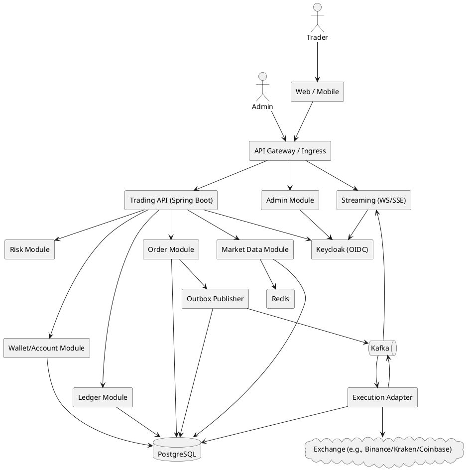
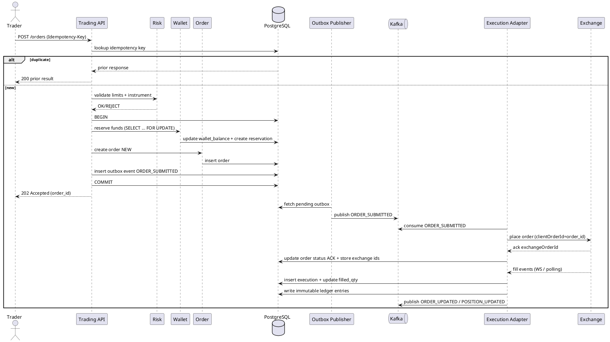

# SPEC-1-Enterprise Java Project

## Background
You want to build an **enterprise-level Java system** that’s production-ready (secure, scalable, observable, maintainable) and implementable by a contractor team.

**Working assumptions (until you confirm):**
- Backend: Java 21 + Spring Boot (REST APIs)
- Deployment: containers (Docker) on Kubernetes (or a managed equivalent)
- Data: PostgreSQL for core data; Redis for caching
- Async/eventing: Kafka (if needed)
- Auth: OAuth2/OIDC (e.g., Keycloak / enterprise IdP)

## Requirements

### Product scope assumptions (confirmed)
- A **brokerage-style crypto trading platform** (web + API) with **order placement**, **portfolio/positions**, **internal accounting/ledger**, and **admin/compliance**.
- **Execution venue**: **Binance Spot** (omnibus account).
- **Trading scope (MVP)**: **Spot-only**.
- **Funding scope (MVP)**: **admin credit/debit (simulated deposits)** only (no on-chain deposits/withdrawals).
- **Client scope (MVP)**: **API-only** (Swagger/OpenAPI UI + Postman collection; no custom web UI).
- **Deployment (MVP)**: **single VM** (Docker Compose).
- Users are authenticated customers (or internal traders) with role-based permissions.
- MVP supports a curated instrument list (e.g., BTCUSDT, ETHUSDT) with precision/filters configured.

### Must have
- **User & org management**: sign-up/invite, roles (trader, viewer, admin, compliance), MFA support.
- **Authentication/Authorization**: OAuth2/OIDC, RBAC/ABAC policies, session/device controls.
- **Trading accounts**: KYC/KYB status flags, account limits, balances, portfolio & positions.
- **Order management**:
  - Place/modify/cancel orders (market/limit for MVP), idempotent APIs.
  - Order lifecycle states (NEW, ACK, PARTIALLY_FILLED, FILLED, CANCELED, REJECTED, EXPIRED).
  - Server-side validation (limits, balance, instrument status).
- **Execution integration** (MVP): Binance Spot connector (omnibus).
- **Market data** (MVP): instrument list + latest price snapshots; optional streaming.
- **Risk controls (pre-trade)**: per-account order size limits, max position, max notional, price band checks.
- **Ledger & auditability**:
  - Immutable event/audit log for all order actions and admin changes.
  - Account balance/position changes must be traceable to executions/adjustments.
- **Admin APIs (no custom UI in MVP)**: user/account management, limits configuration, manual adjustments (with dual control).
- **API contract deliverables**:
  - **OpenAPI** (Swagger UI) published at runtime.
  - **Postman collection** generated from OpenAPI and versioned in repo.
- **Observability**: structured logs, metrics, tracing, alerting hooks.
- **Security**: encryption in transit, encryption at rest (where possible), secrets management, audit trails.

### Should have
- **Real-time updates** for orders/positions via WebSocket/SSE.
- **Advanced orders**: stop, stop-limit, OCO, trailing stop.
- **Post-trade**: confirmations, statements, trade history exports.
- **Compliance features**: surveillance flags, restricted instruments/users, retention policies.
- **Multi-tenant support** (if B2B): tenant isolation, per-tenant limits/config.
- **HA & DR**: multi-AZ deployment, defined RPO/RTO, automated backups/restore drills.

### Could have
- **Matching engine** (if you’re building an exchange-like product) with order book.
- **Multi-venue smart routing**.
- **Margin/borrow**, fees/commissions engine, rebates.
- **Mobile app**.
- **Machine learning** alerts (fraud, anomaly detection).

### Won’t have (for MVP)
- Margin/futures/options/derivatives.
- On-chain deposits/withdrawals (or Binance transfer automation).
- Multiple asset classes and complex order types beyond market/limit.
- Full-scale market surveillance suite.
- Cross-region active/active (unless mandated).

### Non-functional targets (initial proposal) (initial proposal)
- **Users**: 1,000+ (support bursts; plan for 10x growth).
- **Latency** (API): p95 < 200ms for non-trade endpoints; order placement p95 < 500ms (excluding external venue latency).
- **Availability**: 99.9% for core API.
- **Data integrity**: exactly-once effects for order submission (idempotency + dedupe), strong consistency for ledger.

## Method

### Tech stack (version-pinned)
- **Java 21 (LTS)**
- **Spring Boot 3.5.11**
- **PostgreSQL 18.2**
- **Redis** for caching + ephemeral state (price snapshots, rate limit counters)
- **Kafka 4.2** for asynchronous workflows (outbox → event bus)
- **Identity**: Keycloak 26.5.3 (OIDC) *(or your enterprise IdP)*
- **DB migrations**: Flyway
- **Observability**: Spring Boot Actuator + Micrometer Tracing (OpenTelemetry/OTLP)
- **Exchange connectivity**: Knowm **XChange** (core + per-exchange module) with a fallback “custom connector” layer when an exchange feature isn’t supported.

> Design choice for 1,000+ users: start as a **modular monolith** (single deployable) with clean bounded contexts and an **event-driven internal spine** (outbox + Kafka). This keeps MVP fast to ship but makes it easy to split services later. for 1,000+ users: start as a **modular monolith** (single deployable) with clean bounded contexts and an **event-driven internal spine** (outbox + Kafka). This keeps MVP fast to ship but makes it easy to split services later.

### Similar systems (what we’re emulating)
Most crypto brokerages expose **REST for order management** and **WebSocket for market data / order updates** (e.g., Coinbase Advanced Trade API, Binance Spot API, Kraken API). Our platform mirrors that shape: a stable internal domain model, with adapters per venue.

### High-level architecture

#### Components
- **API Layer**
  - Trading REST API (orders, cancels, account/portfolio queries)
  - Streaming API (WebSocket/SSE for order + portfolio updates)
  - Swagger/OpenAPI endpoints
- **Core Domain Modules (bounded contexts)**
  - Identity & RBAC
  - Instruments & market data
  - Accounts/Wallets (balances + reservations)
  - Orders & executions
  - Risk controls (pre-trade checks)
  - Ledger (immutable accounting)
  - Admin & compliance
- **Integration Modules**
  - Binance connector: REST + WS user streams
  - Notifications: email/SMS/webhooks (optional)
- **Infrastructure (single VM for MVP)**
  - PostgreSQL
  - Redis
  - Kafka (topics: orders, executions, ledger)
  - Reverse proxy + TLS termination (e.g., Nginx/Caddy)
  - Observability stack (logs + metrics export)

#### Deployment on a single VM (MVP)
- All components run as **Docker containers via Compose**.
- Public surface area:
  - `443/tcp` only (reverse proxy)
  - optional: VPN/SSH for admin access
- Minimal process set (recommended):
  - `trading-api` (REST + swagger)
  - `streaming` (WS/SSE) *(can be merged into trading-api if you want 1 process)*
  - `worker-exec` (outbox publisher + kafka consumers + binance connector)
  - `postgres`, `redis`, `kafka`, `keycloak`, `reverse-proxy`

#### PlantUML: deployment diagram (single VM)
```plantuml
@startuml
node "Single VM" {
  node "Docker Network" {
    [Reverse Proxy
TLS :443] as RP
    [Trading API
Spring Boot] as API
    [Streaming
WS/SSE] as Stream
    [Worker
Outbox+Kafka+Binance] as Worker
    database "PostgreSQL" as PG
    [Redis] as Redis
    [Kafka] as Kafka
    [Keycloak] as KC
  }
}

actor "Client" as Client
Client --> RP
RP --> API
RP --> Stream
API --> PG
API --> Redis
API --> Kafka
API --> KC
Worker --> PG
Worker --> Kafka
Worker --> Redis
Stream --> Kafka

cloud "Binance Spot" as Binance
Worker --> Binance
@enduml
```

#### PlantUML: component diagram


### Core flow: Place order (idempotent + auditable)
**Key properties**
- **Idempotency**: client sends `Idempotency-Key` header; server returns the first result for duplicates.
- **Exactly-once effects** (within our system): achieved via DB transaction + unique constraints + outbox.
- **No overspending**: balance reservation using row-level locks.

#### PlantUML: sequence (place order)


### Exchange integration strategy (brokerage-style, omnibus + Binance)

#### Omnibus model implications
- There is **one Binance Spot account** holding total funds.
- Your platform keeps a **per-user internal ledger** (wallets, reservations, positions) and enforces pre-trade checks.
- Because the exchange balance is shared, we add **reconciliation + circuit breakers**:
  - Scheduled jobs compare **Binance balances + open orders** vs **internal totals**.
  - If drift exceeds a threshold, the system **pauses new orders** and alerts.

#### Binance-specific mechanics (what we rely on)
- **Order placement**: Spot REST trading endpoints allow setting a client order identifier (commonly `newClientOrderId`).
- **Order updates**: user data stream provides `executionReport` events containing the client order id and status updates.
- **User stream subscription**: use the WebSocket API user-data-stream subscription method(s) supported for the account.
- **Rate limiting**: connector must back off on `429` and avoid escalating to IP bans.

#### Connector responsibilities (BinanceAdapter)
- Symbol/instrument mapping + precision/filter enforcement (min qty/notional, step sizes).
- **Submit order**
  - set `newClientOrderId = order_id` (or a derived stable value) so fills map back.
  - choose response type (ACK for speed, RESULT for richer info) depending on endpoint options. )
- **Cancel order**: map internal `order_id` → exchange `clientOrderId` or `orderId`.
- **Order/fill ingestion**
  - maintain 1–N resilient WS connections.
  - subscribe with `userDataStream.subscribe.signature` using API key + signature (simpler than session logon). )
  - parse `executionReport` → internal `OrderUpdated`, `ExecutionRecorded`. )
- Resilience:
  - reconnect w/ exponential backoff
  - on reconnect, run a **catch-up**: query open orders + recent trades to fill gaps.

### Data model (PostgreSQL)

#### Core tables (MVP)
**Identity / access**
- `users(id, email, status, created_at, ...)`
- `user_roles(user_id, role)`

**Instruments**
- `instruments(id, symbol, base_asset, quote_asset, exchange, status, price_precision, qty_precision, min_qty, min_notional, ...)`

**Accounts / wallets**
- `accounts(id, user_id, status, kyc_status, created_at, ...)`
- `wallet_balances(account_id, asset, available, reserved, updated_at, PRIMARY KEY(account_id, asset))`
- `wallet_reservations(id, account_id, asset, amount, order_id, status, created_at, released_at)`

**Orders / executions**
- `orders(id, account_id, instrument_id, side, type, tif, qty, price, status, filled_qty, client_order_id, exchange_order_id, created_at, updated_at)`
- `executions(id, order_id, exchange_trade_id, qty, price, fee_asset, fee_amount, executed_at)`
- `order_events(id, order_id, event_type, payload_json, created_at)` *(audit for state transitions)*

**Ledger (immutable accounting)**
- `ledger_transactions(id, correlation_id, type, created_at)`
- `ledger_entries(id, tx_id, account_id, asset, direction, amount, ref_type, ref_id)`
  - `direction` = DEBIT/CREDIT
  - constraints: sum(debits) == sum(credits) per tx + asset (enforced by app + checks)

**Idempotency + outbox**
- `idempotency_keys(key, user_id, request_hash, response_json, status, created_at, expires_at)`
- `outbox_events(id, aggregate_type, aggregate_id, event_type, payload_json, status, created_at, published_at)`

**Risk & admin**
- `account_limits(account_id, max_order_notional, max_position_notional, max_daily_notional, price_band_bps, updated_by, updated_at)`
- `audit_log(id, actor_user_id, action, entity_type, entity_id, before_json, after_json, created_at, ip)`

#### Indexing & constraints (key ones)
- Unique: `orders(client_order_id)` (scoped per account if needed)
- Unique: `executions(exchange_trade_id)` (scoped per exchange)
- Indexes:
  - `orders(account_id, created_at desc)`
  - `orders(exchange_order_id)`
  - `executions(order_id, executed_at)`
  - `wallet_balances(account_id, asset)`
  - `outbox_events(status, created_at)`

### Consistency & concurrency rules
- **Wallet reservation** is the concurrency gate:
  - `SELECT ... FOR UPDATE` on `wallet_balances` row (account_id + asset)
  - Move `available → reserved` atomically
- **Order state machine**: only forward transitions; use `order_events` as an audit trail.
- **Idempotent exchange submits**:
  - Prefer exchange-supported `clientOrderId`.
  - Otherwise: store a deterministic hash of the submit payload and dedupe locally.

### Security design
- OIDC login via Keycloak; APIs validate JWTs.
- RBAC roles: `TRADER`, `VIEWER`, `ADMIN`, `COMPLIANCE`.
- Rate limiting per user/account (Redis counters) + WAF at ingress.
- Exchange API keys/secrets:
  - Stored encrypted (KMS/Vault) + decrypted only in the execution adapter.
  - Strict rotation + least privilege.
- Full audit log for admin actions and money-moving operations.

### Observability
- Metrics: request latency, order throughput, fill latency, connector error rates.
- Tracing: OpenTelemetry spans across API → DB → Kafka → execution adapter.
- Logs: structured JSON with `correlation_id` (order_id is a natural correlation id).

## Implementation

### Repo + module layout (single deployable)
- `apps/trading-api` (REST + auth)
- `apps/streaming` (WS/SSE gateway)
- `modules/domain-*`
  - `domain-orders`, `domain-wallet`, `domain-ledger`, `domain-risk`, `domain-instruments`, `domain-admin`
- `modules/integration-binance`
  - REST client + WS consumer + mapping/adapters
  - (Optional) use XChange `xchange-binance` / `xchange-stream-binance` as a base, wrap it behind your own interface
- `modules/infra`
  - Flyway migrations, outbox publisher, Kafka wiring, Redis helpers, observability
- `deploy/`
  - Helm chart + Kubernetes manifests + runbooks

### Engineering steps (contractor-ready)
1) **Bootstrap (Maven, multi-module)**
   - Create a **parent POM** (`packaging=pom`) managing:
     - Spring Boot plugin + dependency management (BOM)
     - Java 21 toolchain
     - Enforcer (JDK/version) + formatter + checkstyle/spotbugs (optional)
   - Modules: `apps/trading-api`, `apps/streaming`, `modules/*`, `deploy/*`
   - Local dev via `docker-compose` (Postgres/Redis/Kafka)
   - Flyway baseline migration + health checks

2) **Security baseline**
   - Keycloak realm + roles
   - Spring)source server, role guards
   - Basic rate limiting (Redis)
3) **DB schema + core invariants**
   - Flyway migrations for: accounts, wallets, reservations, orders, executions, le)idempotency, outbox
   - Wallet reservation with `SELECT ... FOR UPDATE` (prevents overspend)te machine with append-only `order_events`
4) **Trading REST API**
   - `POST /v1/orders` (idempotent)
   - `POST /v1/orders/{id}/cancel`
   - `GET /v1/orders` + `GET /v1/orders/{id}`
   - `GET /v1/portfolio`, `GET /v1/balances`
5) **Outbox + Kafka spine**
   - Write `ORDER_SUBMITTED` into outbox in the same DB tx as order creation
   - Outbox publisher publishes to Kafka and marks events published
   - Topic design (MVP):
     - `orders.submitted` (key=`order_id`)
     - `orders.updated` (key=`order_id`)
     - `executions.recorded` (key=`order_id`)
     - `balances.updated` (key=`account_id`)
   - Partitioning: start with 3–6 partitions per topic; **keying by order_id keeps ordering per order**
   - Consumer groups:
     - `cg-exec-adapter` consumes `orders.submitted`
     - `cg-ledger` consumes executions/order updates (or keep ledger update in adapter for MVP)
     - `cg-streaming` consumes updates to push to WS/SSE

6) **Binance integration (omnibus)** (omnibus)**
   - Implement `BinanceAdapter`:
     - submit/cancel/query orders (REST)
     - subscribe to account events via WebSocket API signature subscription
     - map Binance `clientOrderId` )_id`
   - Implement reconnect + catch-up logic:
     - on reconnect: fetch o)nt executions and reconcile gaps
7) **Ledger + portfolio updates**
   - On fills: create immutable ledger transactions (base/quote + fees)
   - Release reservations, update balances and positions
8) **Client updates**
   - WS/SSE pushes for: order updates, executions, balances
   - Authorization: user sees only own account; admin/compliance can query cross-account
9) **Admin + ops tools (MVP)**
   - Configure limits, freeze/unfreeze trading
   - Manual credit/debit (MVP “deposit simulation”)
   - View reconciliation status, connector health, and audit logs
10) **Reconciliation + circuit breakers**
   - Hourly: compare Binance balances + open orders vs internal totals
   - Drift policy: auto-pause new orders if drift > threshold; require admin acknowledgement to resume
11) **Testing & quality**
   - Unit tests for state machine + wallet locks
   - Integration tests via Testcontainers (Postgres/Kafka/Redis)
   - Connector tests using Binance testnet/sandbox where available
12) **Deployment (single VM MVP)**
   - Docker Compose stack:
     - reverse proxy (TLS), keycloak, postgres, redis, kafka, trading-api, streaming, worker
   - TLS:
     - Let’s Encrypt (recommended) or bring-your-own certificate
   - Host hardening:
     - firewall allowlist (443 + SSH via VPN/allowlisted IP)
     - log rotation + disk alerts
     - backups: nightly Postgres dumps + WAL archiving (if enabled)
   - Release strategy:
     - blue/green via two compose projects (or simple rolling restart for MVP)
   - Future migration plan:
     - keep Compose files close to Kubernetes manifests/Helm values to ease later move

### API-only deliverables
- OpenAPI published via `springdoc-openapi`.
- Postman collection generated from OpenAPI as part of CI (committed artifact or build output).
  - Example tool: openapi-to-postman (CLI) in CI.

